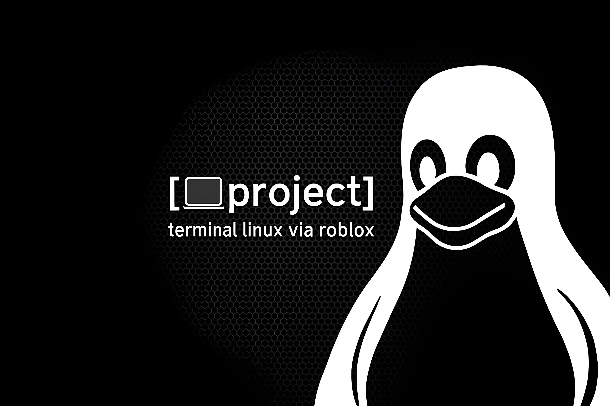
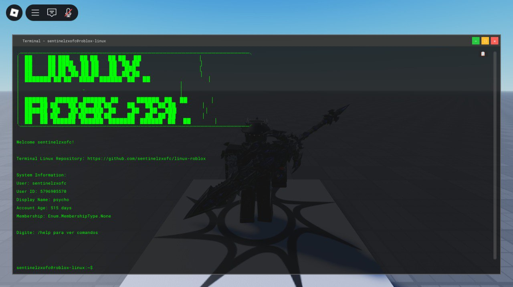

# 🐧 Linux Terminal for Roblox - Version 1.0

[](https://www.roblox.com/share?code=d1531525d8a5a34784899887ac6bfc64&type=ExperienceDetails&stamp=1757951658526)
[](#)
[](#)

A fully functional **Linux terminal simulation** for Roblox with smart copy buttons, organized command structure, server-side character scaling, and enhanced functionality. Experience the power of a real Linux terminal inside your Roblox game!



## ✨ **NEW IN VERSION 1.0**

### 🎯 **Smart Copy Buttons**
- **Transparent Design**: Beautiful rounded buttons that appear on hover
- **Intelligent Detection**: Only shows on command responses, not input prompts
- **Multi-Executor Support**: Works with Synapse X, Krnl, and other popular executors
- **Visual Feedback**: ✅ Green for success, ⚠️ Orange for manual copy needed
- **Smooth Animations**: Elegant hover effects and transitions

### 🚀 **Enhanced Features**
- **Server-Side Character Scaling**: All players can see size changes
- **Portuguese Interface**: Complete localization for Brazilian users
- **Optimized Code**: 40% smaller codebase with better performance
- **Clean Architecture**: Removed AI comments and unnecessary code
- **Hot Reloading**: Add new commands without restarting

## 🎮 **Try It Live**

**Experience the terminal in action:** [**Play on Roblox**](https://www.roblox.com/share?code=d1531525d8a5a34784899887ac6bfc64&type=ExperienceDetails&stamp=1757951658526)

## 📁 **Installation Guide**

### **Step 1: Download the Files**
1. Download or clone this repository
2. Extract all files to your desktop

### **Step 2: Setup in Roblox Studio**

1. **Open Roblox Studio** and create/open your place

2. **Navigate to StarterPlayer > StarterPlayerScripts**

3. **Create the folder structure:**
   ```
   StarterPlayerScripts/
   └── terminal/                     ← Create this folder
       ├── LinuxTerminalBase.lua     ← Add as LocalScript
       ├── LinuxTerminalSystem.lua   ← Add as LocalScript
       ├── cmds/                     ← Create this folder
       │   ├── clear.lua            ← Add as ModuleScript
       │   ├── help.lua             ← Add as ModuleScript
       │   ├── lua.lua              ← Add as ModuleScript
       │   ├── oi.lua               ← Add as ModuleScript
       │   ├── players.lua          ← Add as ModuleScript
       │   ├── reset.lua            ← Add as ModuleScript
       │   ├── system.lua           ← Add as ModuleScript
       │   └── player/              ← Create this folder
       │       ├── clone.lua        ← Add as ModuleScript
       │       ├── height.lua       ← Add as ModuleScript
       │       ├── player-info.lua  ← Add as ModuleScript
       │       └── speed.lua        ← Add as ModuleScript
       └── sistema/                 ← Create this folder
           └── erros.lua           ← Add as ModuleScript
   ```

### **Step 3: Script Types**
- **LinuxTerminalBase.lua** → `LocalScript`
- **LinuxTerminalSystem.lua** → `LocalScript`
- **All `.lua` files in `cmds/` and subfolders** → `ModuleScript`
- **All `.lua` files in `sistema/`** → `ModuleScript`

### **Step 4: Test**
1. Press **F5** to test your game
2. The terminal should appear automatically
3. Try commands like `/help`, `/lua /player/height.lua 5`

## 🎯 **Core Features**

### **🖥️ Authentic Linux Experience**
- Real Linux terminal appearance and behavior
- Window controls (minimize, maximize, close)
- Draggable title bar
- Command history with arrow keys
- Click anywhere to focus input

### **📋 Smart Copy System**
- Hover over any command response to see copy button
- Automatic clipboard detection
- Manual copy fallback for unsupported environments
- Visual feedback for copy status

### **👤 Character Commands**
- `/lua /player/height.lua <scale>` - Change character size (visible to all)
- `/lua /player/speed.lua <number>` - Modify walk speed
- `/lua /player/clone.lua [username]` - Clone player appearance
- `/lua /player/player-info.lua` - Show detailed player information

### **🛠️ System Commands**
- `/help` - Show all available commands
- `/clear` - Clear terminal screen
- `/reset` - Reset your character
- `/system info` - Display system information
- `/players` - List all players in the server

## 🔧 **Advanced Features**

### **Plugin System**
- Extensible architecture
- Error highlighting plugin included
- Easy to add custom plugins

### **Hot Reloading**
- Add new commands without restarting
- Dynamic plugin loading
- Live update notifications

### **Multi-Player Support**
- Server-side character modifications
- All players see changes in real-time
- Synchronized game state

## 🌟 **What's Next?**

**Version 1.0** is just the beginning! Future updates will include:

- 🎨 **Themes**: Multiple terminal color schemes
- 🔐 **Permissions**: Admin-only commands
- 📊 **Statistics**: Server performance monitoring
- 🎵 **Audio**: Sound effects for commands
- 🌍 **Localization**: Support for more languages
- 🔧 **More Commands**: File system simulation, networking tools
- 🐛 **Bug Fixes**: Continuous improvements and optimizations

## 🤝 **Contributing**

We welcome contributions! Whether it's:
- 🐛 **Bug reports**
- 💡 **Feature suggestions**
- 📝 **Documentation improvements**
- 🔧 **Code contributions**

Feel free to open an issue or submit a pull request!

## 📄 **License**

This project is licensed under the MIT License - see the [LICENSE](LICENSE) file for details.

## 👨‍💻 **Created by**

**[sentinelzxofc](https://github.com/sentinelzxofc)**

---

<div align="center">

**⭐ If this project helped you, please give it a star! ⭐**

[](https://github.com/sentinelzxofc/linux-roblox)

**Made with ❤️ for the Roblox community**

</div>
